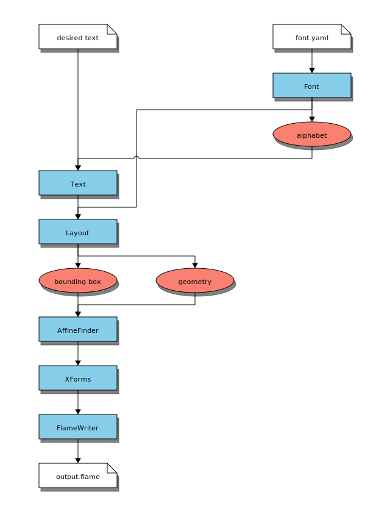

# Affine Font Indeed

This script will take text such as

```
HELLO
WORLD
```

and calculates a bunch of affine transforms to turn this into a
fractal. The output is a .flame file used in Apophysis
and similar fractal flame editors.

When loaded into Apophysis, the flame will look something like this.
You can tweak the parameters when done.


## Installation

Run `pip install -r requirements.txt` to install the required packages

## Usage

```
./affine_font_indeed.py [-b/--block-padding] <fname> <flame_name> <text>
```

Where:

* `fname` is the filename of the output file. For example `output/hello.flame`
* `flame_name` is a name for the fractal inside the flame file.
* `text` is the desired text. If you want multiple lines of text, use
  literal newlines. For example, in bash `$'hello\nworld'`. Note that
  the text will be converted to uppercase and special characters will be
  turned into the padding character
* `-b/--block-padding` If specified, strings will be padded to the same
  width with `█` instead of ` `. This makes the fractal more solid-looking

## Example commands

```
# This generates the example image above
./affine_font_indeed.py output/hello.flame Hello $'Hello\nWorld'

# The first line is shorter than the second. Use a padding character
# so the fractal has less holes
./affine_font_indeed.py output/birthday.flame "Happy Birthday" $'Happy\Birthday'
```

## Notes

* This fractal is a generalization of the "COKE" fractal in 
  Fractals Everwhere, 2nd Ed. by Michael F. Barnsley. The fractal appears as 
  Figure III.73 on page 98. 
* Right now, this script only supports the characters A-Z. I may add
  some special characters on an ad-hoc basis. I do not plan to expand to
  lowercase or non-English characters. If you want to contribute more
  characters, please let me know.

## How it Works

Here is a flowchart of how data flows through the program:



1. The user enters the desired text such as `Hello\nWorld` along
   with other command line arguments
1. The desired text is pre-processed into a `Text` object. This splits
   the string into multiple lines and pads out the text. The `Text`
   object keeps track of the grid of characters.
1. The font geometry is loaded from the YAML file. This is
   represented by a `Font` object
1. From this `Font` object, the script extracts a list of what
   characters are currently supported by the font, the "alphabet"
1. The alphabet is used to "sanitize" the `Text` object. Any
   character that is not in the alphabet are replaced by the
   padding character
1. The `Text` and `Font` objects are used to construct a `Layout`
   object. This object handles positioning the letters in the
   text in "world space" coordinates"
1. The `Layout` calculates a bounding box for the text in world
   space. It also computes the position of every letter in
   the text in world space
1. This geometry data is passed to an `AffineFinder` to get
   a list of transforms (of class `XForm`). For the math behind
   this, see below
1. These `XForm`s are passed through a `FlameWriter`. This renders
   an XML `.flame` file in the format Apophysis uses
1. The rendered `.flame` file is written to disk

### Solving for Affine Transforms

Affine transformations used for this font are of the
form

```
AX + b = X'
```

More specifically, we want to map a large triangle (the bounding
box of the text) onto a smaller triangle (one of the "strokes" in
the lettering). Thus, we have a matrix equation like this:

```
Note: Triangles look like they appear in Apophysis:

Y
|
|
|
O----X


[a b] * [Ox Xx Yx] + [e] = [Ox' Xx' Yx']
[c d]   [Oy Xy Yy]   [f]   [Oy' Xy' Yy']
 
 A    *     X      +  b  =   X'
 
 2x2       2x3       2x1       2x3
      (bounding box)        (stroke)
```

Note that we can add a row of 1s to express
this equation more concisely as follows:

```
[a b e] * [Ox Xx Yx] = [Ox' Xx' Yx']
[c d f]   [Oy Xy Yy]   [Oy' Xy' Yy'] 
          [ 1  1  1]

 [A b]  *    [X]     =    X'
             [1]

 2x3        3x3            2x3 
```

Now, we want to solve for the leftmost matrix.
I did this by transposing the equation first

```
([A b] * [X]).T = X'.T
         [1]

([X]).T * [A b].T = X'.T
 [1]

[X.T 1] * [A.T] = X'.T
          [b.T]
```

Let's expand that last line to be more clear

```
[Ox Oy 1] * [a c] = [Ox' Oy']
[Xx Xy 1]   [b d]   [Xx' Xy']
[Yx Yy 1]   [e f]   [Yx' Yy']
```

Now all that's left is to let Numpy solve this equation
for the parameters `a, b, c, d, e and f`.

### Notes on Apophysis Format

`.flame` files stores these parameters in a different order
and in a slightly different coordinate system. Using my
notation above, the coefficients are written in the following
format:


coefs="a -c -b d e -f"

I am still not entirely sure why the c and b coefficients are negated.
This is more than a a simple y-up vs y-down confusion.

This script compensates for these negations so things show up correctly
in Apophysis
